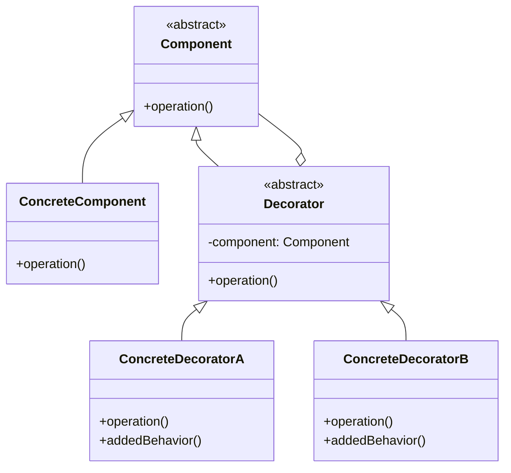
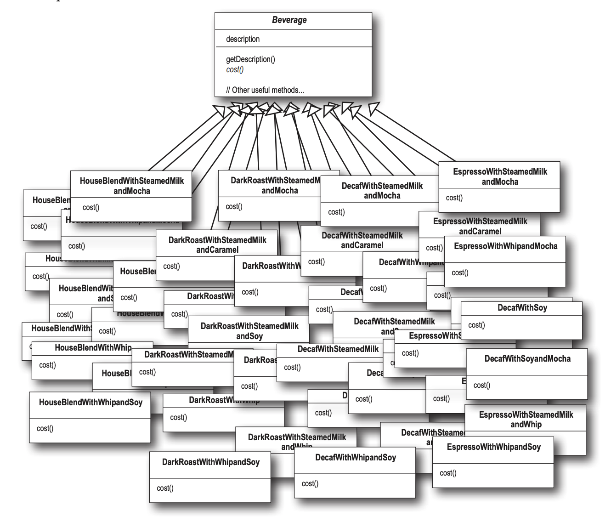
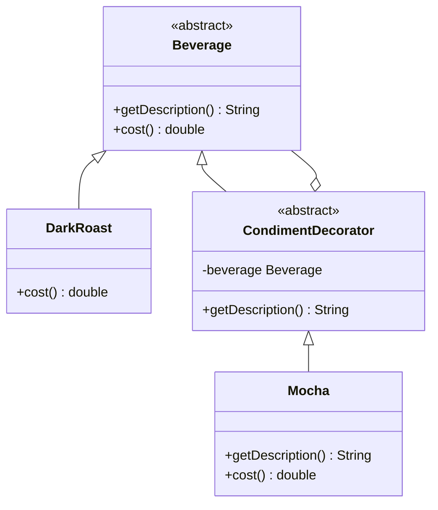

# 데코레이터 패턴

## 🧐 데코레이터 패턴이란?

> 📗 OCP(Open-Closed Principle) 클래스는 확장에는 열려 있어야 하지만 변경에는 닫혀 있어야 한다.

데코레이터 패턴은 OCP를 준수하여 객체에 추가 요소를 동적으로 더할 수 있게 도와주는 구조적 디자인 패턴입니다. 데코레이터를 사용하면 서브클래스를 만들 때보다 훨씬 유연하게 기능을 확장할 수 있어 유연한 구조를 가지는데 도움을 줍니다.

## 🏗️ 데코레이터 패턴의 구조

데코레이터 패턴은 크게 4가지 구성 요소로 이루어집니다.

1. **Component**: 인터페이스 또는 추상 클래스로 객체에 추가할 기능의 뼈대를 정의합니다.
2. **ConcreteComponent**: `Component`를 상속한 구체적인 구현 클래스로 기본 기능을 구현합니다. 이를 통해 만들어진 요소를 구상 구성 요소라고 부릅니다.
3. **Decorator**: `Component`를 확장하는 추상 클래스로 `ConcreteComponent`를 감싸면서 기능을 확장하는 역할을 합니다.
4. **ConcreteDecorator**: `Decorator`의 구체적인 구현 클래스로 `ConcreteComponent`에 새로운 기능을 추가합니다.



## 📝 데코레이터 사용 예시

### 문제 상황

커피 판매점에서 다양한 음료와 토핑을 관리하는 코드를 상속으로 구현하려 한다면, 서브클래스가 기하급수적으로 늘어나 관리가 어렵습니다. 예를 들어 아래와 같이 `Beverage` 클래스를 모두 상속받아서 음료가 만들어진다면 어떻게 될까요?

```java
public abstract class Beverage {
  protected String description = "제목 없음";

  public String getDescription() {
    return description;
  }

  public abstract double cost();
}
```

이 코드에서는 새로운 음료나 토핑이 추가될 때마다 상속을 통해 새로운 클래스를 생성해야 합니다. 이러한 방식은 코드 유지보수와 확장이 어렵고, 다양한 조합의 음료와 토핑을 모두 관리하려면 클래스의 수가 급격히 증가하는 아래와 같은 문제가 발생합니다.



이렇게 서브클래스로 해결하기 어려운 문제를 동적으로 확장할 수 있게 도움을 주는데 데코레이터 패턴이 활용될 수 있습니다.

### 데코레이터 패턴을 사용한 해결책

데코레이터 패턴은 상속을 대체하여 **구성을 통해** 기능을 동적으로 확장할 수 있습니다. 이를 통해 클래스 수가 증가하는 문제를 해결하고, 기능을 유연하게 추가할 수 있게 됩니다.

```java
// Component
public abstract class Beverage {
  protected String description = "제목 없음";

  public String getDescription() {
    return description;
  }

  public abstract double cost();
}

// ConcreteComponent
public class DarkRoast extends Beverage {
  public DarkRoast() {
    description = "다크 로스트 커피";
  }

  @Override
  public double cost() {
    return 0.79;
  }
}

// Decorator
public abstract class CondimentDecorator extends Beverage {
  Beverage beverage;

  public abstract String getDescription();
}

// ConcreteDecorator
public class Mocha extends CondimentDecorator {
  public Mocha(Beverage beverage) {
    this.beverage = beverage;
  }

  @Override
  public String getDescription() {
    return beverage.getDescription() + ", 모카";
  }

  @Override
  public double cost() {
    return this.beverage.cost() + 0.20;
  }
}
```

커피 판매점에 다크 로스트 커피 메뉴와 모카 토핑을 구현한 예시입니다. 각각의 클래스가 데코레이터 패턴에 필요한 요소들을 아래와 같이 담당하고 있습니다.



이렇게 구현하면 `DarkRoast` 같은 **구상 클래스**는 **데코레이터**에 대해 알 필요가 없으며, **데코레이터** 역시 다른 데코레이터를 감싸며 확장할 수 있습니다.

```java
public class StarbuzzCoffee {
  public static void main(String[] args) {
    Beverage darkRoast = new DarkRoast();
    Beverage mochaDarkRoast = new Mocha(darkRoast);
    Beverage doubleMochaDarkRoast = new Mocha(mochaDarkRoast);

    System.out.println(darkRoast.getDescription() + " $" + darkRoast.cost());
    System.out.println(mochaDarkRoast.getDescription() + " $" + mochaDarkRoast.cost());
    System.out.println(doubleMochaDarkRoast.getDescription() + " $" + doubleMochaDarkRoast.cost());
  }
}

--- 출력 ---
> Task :StarbuzzCoffee.main()
다크 로스트 커피 $0.79
다크 로스트 커피, 모카 $0.99
다크 로스트 커피, 모카, 모카 $1.19
```



```mermaid
graph LR
    A["Double Mocha DarkRoast"] --> B["Mocha.cost()"]
    B --> C["Mocha.cost()"]
    C --> D["DarkRoast.cost()"]
    D --> E["$0.79"]
    E --> F["$0.79 + $0.20 = $0.99"]
    F --> G["$0.99 + $0.20 = $1.19"]
    G --> H["Final Cost: $1.19"]

    subgraph "(1) First Mocha"
    B
    end

    subgraph "(2) Second Mocha"
    C
    end

    subgraph "(3) DarkRoast"
    D
    end

    subgraph "(4) DarkRoast Cost"
    E
    end

    subgraph "(5) Add Second Mocha Cost"
    F
    end

    subgraph "(6) Add First Mocha Cost"
    G
    end

    classDef default fill:#f9f,stroke:#333,stroke-width:1px;
    classDef highlight fill:#bbf,stroke:#333,stroke-width:2px;
    class A,H highlight;
```

## 👍 데코레이터 패턴의 장단점 👎

### 장점

- 상속 없이 동적으로 객체의 행동을 확장할 수 있습니다.
- 서로 다른 여러 데코레이터를 구성하여 다양한 기능을 만들 수 있습니다.
- 기존 코드를 수정하지 않고 확장이 가능하므로 유지보수성이 향상됩니다.

### 단점

- 데코레이터가 중첩되면서 객체의 구조가 복잡해질 수 있습니다.
- 관리해야 할 객체가 많아져 실수할 가능성이 높습니다. (**팩토리 패턴** 또는 **빌더 패턴**을 통해 개선 가능)

## 🌍 실제 사용 사례

1. **Java I/O 클래스**: `InputStream`, `OutputStream` 등의 클래스들이 데코레이터 패턴을 사용합니다.
2. **GUI 툴킷**: 윈도우 컴포넌트에 스크롤바, 테두리 등을 동적으로 추가할 때 사용됩니다.
3. **웹 개발**: 미들웨어나 필터를 추가할 때 데코레이터 패턴이 활용됩니다.

## 🎯 결론

데코레이터 패턴은 객체 지향 설계의 유연성을 높이는 강력한 디자인 패턴입니다. 하지만 모든 상황에 적합한 것은 아니므로, 적절한 상황에서 신중하게 사용해야 합니다. 복잡성과 유연성 사이의 균형을 잘 고려하여 적용하는 것이 중요합니다.
