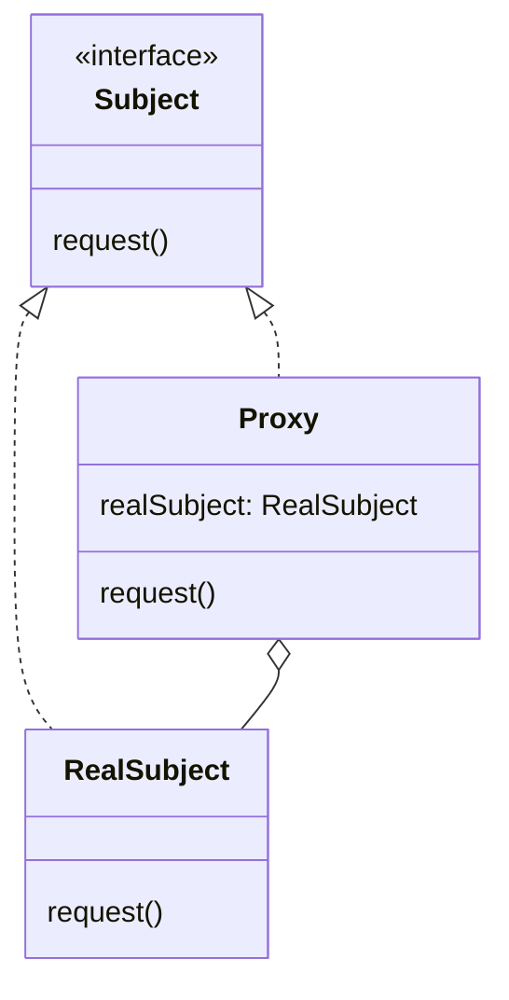

# 프록시 패턴

## 🧐 프록시 패턴이란?

프록시 패턴은 다른 객체에 대한 대리자나 자리표시자 역할을 하는 객체를 제공하는 구조적 디자인 패턴입니다. 프록시는 실제 객체에 대한 접근을 제어하면서, 요청이 실제 객체에 전달되기 전이나 후에 작업을 수행할 수 있게 해줍니다. 또한 필요한 시점에만 실제 객체를 생성하거나 접근합니다.

## 🏗️ 프록시 패턴의 구조

프록시 패턴은 주로 다음과 같은 구조를 가집니다.

1. **Subject**: 프록시와 실제 객체가 공통으로 따르는 인터페이스 또는 추상 클래스입니다.
2. **RealSubject**: 프록시가 대표하는 실제 객체입니다.
3. **Proxy**: RealSubject에 대한 접근을 제어하는 프록시 객체입니다. RealSubject와 동일한 인터페이스를 구현하며, 추가적인 기능(접근 제어, 로깅 등)을 제공합니다.



## 📝 프록시 패턴 사용 예시

### 문제 상황

전국의 여러 지점에 설치된 기계의 상태를 모니터링해야 하는 상황을 가정해봅시다. 각 기계의 위치, 재고, 현재 상태 등의 정보를 실시간으로 확인해야 합니다. 하지만 이를 위해 매번 각 지점을 직접 방문하거나, 지점 담당자에게 연락하여 정보를 수집하는 것은 비효율적이고 시간이 많이 소요됩니다.

또한, 모든 기계의 정보를 한 곳에서 중앙 집중식으로 관리하고 싶지만, 각 기계가 물리적으로 떨어져 있어 이를 구현하기 어려운 상황입니다.

### 프록시 패턴을 사용한 해결책

프록시 패턴을 사용하여 각 기계에 대한 원격 프록시를 만들 수 있습니다. 이 프록시는 실제 기계를 대신하여 필요한 정보를 제공하고, 네트워크 통신을 처리합니다.

```java
public interface GumballMachine extends Remote {
    public int getCount() throws RemoteException;
    public String getLocation() throws RemoteException;
    public State getState() throws RemoteException;
}

public class GumballMachineRemote extends UnicastRemoteObject implements GumballMachine {
    private static final long serialVersionUID = 2L;
    String location;
    int count;
    State state;

    public GumballMachineRemote(String location, int numberGumballs) throws RemoteException {
        this.location = location;
        this.count = numberGumballs;
        state = new NoQuarterState(this);
    }

    public int getCount() throws RemoteException {
        return count;
    }

    public String getLocation() throws RemoteException {
        return location;
    }

    public State getState() throws RemoteException {
        return state;
    }
}

public class GumballMonitor {
    GumballMachine machine;

    public GumballMonitor(GumballMachine machine) {
        this.machine = machine;
    }

    public void report() {
        try {
            System.out.println("Gumball Machine: " + machine.getLocation());
            System.out.println("Current inventory: " + machine.getCount() + " gumballs");
            System.out.println("Current state: " + machine.getState());
        } catch (RemoteException e) {
            e.printStackTrace();
        }
    }
}
```

이 예제에서 `GumballMachineRemote`는 실제 기계를 나타내는 원격 객체이고, `GumballMonitor`는 이 원격 객체에 대한 프록시 역할을 합니다. `GumballMonitor`는 원격 객체의 메소드를 호출하여 필요한 정보를 가져오고, 이를 보고서 형태로 출력합니다.

이 방식을 사용하면 다음과 같은 이점이 있습니다.

1. 중앙에서 모든 기계의 상태를 모니터링할 수 있습니다.
2. 실제 기계에 직접 접근하지 않고도 필요한 정보를 얻을 수 있습니다.
3. 네트워크 통신의 복잡성을 프록시가 처리하므로, 클라이언트 코드가 단순해집니다.
4. 필요한 경우 프록시에서 캐싱을 구현하여 네트워크 요청을 줄일 수 있습니다.

```java
public class GumballMachineTestDrive {
    public static void main(String[] args) {
        String[] location = {"rmi://santafe.mightygumball.com/gumballmachine",
                             "rmi://boulder.mightygumball.com/gumballmachine",
                             "rmi://seattle.mightygumball.com/gumballmachine"};

        GumballMonitor[] monitor = new GumballMonitor[location.length];

        for (int i=0; i < location.length; i++) {
            try {
                GumballMachine machine = (GumballMachine) Naming.lookup(location[i]);
                monitor[i] = new GumballMonitor(machine);
                System.out.println(monitor[i]);
            } catch (Exception e) {
                e.printStackTrace();
            }
        }

        for (int i=0; i < monitor.length; i++) {
            monitor[i].report();
        }
    }
}

--- 출력 예시 ---
Gumball Machine: santafe.mightygumball.com
Current inventory: 100 gumballs
Current state: waiting for quarter

Gumball Machine: boulder.mightygumball.com
Current inventory: 50 gumballs
Current state: waiting for turn of crank

Gumball Machine: seattle.mightygumball.com
Current inventory: 75 gumballs
Current state: gumball sold
```

이 예시에서는 여러 지역의 기계 상태를 한 번에 모니터링할 수 있음을 보여줍니다. 프록시 패턴을 사용함으로써, 물리적으로 떨어져 있는 여러 객체를 마치 로컬에 있는 것처럼 다룰 수 있게 되었습니다.

## 🔄 프록시의 종류

프록시 패턴은 다양한 용도로 사용될 수 있습니다. 주요 종류는 다음과 같습니다.

1. **원격 프록시 (Remote Proxy)**: 원격 객체에 대한 로컬 대리자 역할을 합니다.
2. **가상 프록시 (Virtual Proxy)**: 생성하는 데 많은 비용이 드는 객체에 대해 필요할 때까지 생성을 미루는 역할을 합니다.
3. **보호 프록시 (Protection Proxy)**: 원래 객체에 대한 접근 권한을 제어합니다.
4. **캐싱 프록시 (Caching Proxy)**: 비용이 많이 드는 작업의 결과를 임시로 저장합니다.

## 🛡️ 보호 프록시 (Protection Proxy)

보호 프록시는 접근 권한을 제어하는 프록시입니다. 이는 객체에 대한 접근을 제어하고 객체마다 접근 권한을 다르게 하고자 할 때 유용합니다.

### 보호 프록시의 주요 특징

1. **접근 제어**: 클라이언트의 권한에 따라 객체에 대한 접근을 허용하거나 거부합니다.
2. **보안**: 중요한 객체를 보호하고 무단 접근을 방지합니다.
3. **로깅**: 객체에 대한 접근을 기록할 수 있습니다.

### 보호 프록시 예제: 데이팅 서비스

데이팅 서비스에서 사용자의 개인 정보를 보호하는 예제를 통해 보호 프록시를 살펴보겠습니다.

```java
interface PersonBean {
    String getName();
    String getGender();
    String getInterests();
    int getHotOrNotRating();

    void setName(String name);
    void setGender(String gender);
    void setInterests(String interests);
    void setHotOrNotRating(int rating);
}

class PersonBeanImpl implements PersonBean {
    private String name;
    private String gender;
    private String interests;
    private int rating;
    private int ratingCount = 0;

    public String getName() { return name; }
    public String getGender() { return gender; }
    public String getInterests() { return interests; }
    public int getHotOrNotRating() {
        if (ratingCount == 0) return 0;
        return (rating / ratingCount);
    }

    public void setName(String name) { this.name = name; }
    public void setGender(String gender) { this.gender = gender; }
    public void setInterests(String interests) { this.interests = interests; }
    public void setHotOrNotRating(int rating) {
        this.rating += rating;
        ratingCount++;
    }
}

class OwnerProxy implements PersonBean {
    PersonBean person;

    public OwnerProxy(PersonBean person) {
        this.person = person;
    }

    public String getName() { return person.getName(); }
    public String getGender() { return person.getGender(); }
    public String getInterests() { return person.getInterests(); }
    public int getHotOrNotRating() { return person.getHotOrNotRating(); }

    public void setName(String name) { person.setName(name); }
    public void setGender(String gender) { person.setGender(gender); }
    public void setInterests(String interests) { person.setInterests(interests); }

    public void setHotOrNotRating(int rating) {
        throw new IllegalAccessError("You can't rate yourself!");
    }
}

class NonOwnerProxy implements PersonBean {
    PersonBean person;

    public NonOwnerProxy(PersonBean person) {
        this.person = person;
    }

    public String getName() { return person.getName(); }
    public String getGender() { return person.getGender(); }
    public String getInterests() { return person.getInterests(); }
    public int getHotOrNotRating() { return person.getHotOrNotRating(); }

    public void setName(String name) {
        throw new IllegalAccessError("You can't change someone else's name!");
    }
    public void setGender(String gender) {
        throw new IllegalAccessError("You can't change someone else's gender!");
    }
    public void setInterests(String interests) {
        throw new IllegalAccessError("You can't change someone else's interests!");
    }

    public void setHotOrNotRating(int rating) {
        person.setHotOrNotRating(rating);
    }
}
```

이 예제에서는 두 가지 보호 프록시를 사용합니다.

1. `OwnerProxy`: 사용자 자신의 프로필에 대한 접근을 제어합니다. 사용자는 자신의 정보를 변경할 수 있지만, 자신의 평점을 매길 수 없습니다.

2. `NonOwnerProxy`: 다른 사용자의 프로필에 대한 접근을 제어합니다. 다른 사용자의 정보를 볼 수 있고 평점을 매길 수 있지만, 정보를 변경할 수 없습니다.

### 보호 프록시 사용 예시

```java
public class MatchMakingTestDrive {
    HashMap<String, PersonBean> datingDB = new HashMap<String, PersonBean>();

    public static void main(String[] args) {
        MatchMakingTestDrive test = new MatchMakingTestDrive();
        test.drive();
    }

    public MatchMakingTestDrive() {
        initializeDatabase();
    }

    public void drive() {
        PersonBean joe = getPersonFromDatabase("Joe Javabean");
        PersonBean ownerProxy = getOwnerProxy(joe);
        System.out.println("Name is " + ownerProxy.getName());
        ownerProxy.setInterests("bowling, Go");
        System.out.println("Interests set from owner proxy");
        try {
            ownerProxy.setHotOrNotRating(10);
        } catch (Exception e) {
            System.out.println("Can't set rating from owner proxy");
        }
        System.out.println("Rating is " + ownerProxy.getHotOrNotRating());

        PersonBean nonOwnerProxy = getNonOwnerProxy(joe);
        System.out.println("Name is " + nonOwnerProxy.getName());
        try {
            nonOwnerProxy.setInterests("bowling, Go");
        } catch (Exception e) {
            System.out.println("Can't set interests from non owner proxy");
        }
        nonOwnerProxy.setHotOrNotRating(3);
        System.out.println("Rating set from non owner proxy");
        System.out.println("Rating is " + nonOwnerProxy.getHotOrNotRating());
    }

    PersonBean getOwnerProxy(PersonBean person) {
        return new OwnerProxy(person);
    }

    PersonBean getNonOwnerProxy(PersonBean person) {
        return new NonOwnerProxy(person);
    }

    void initializeDatabase() {
        PersonBean joe = new PersonBeanImpl();
        joe.setName("Joe Javabean");
        joe.setInterests("cars, computers, music");
        joe.setHotOrNotRating(7);
        datingDB.put(joe.getName(), joe);

        PersonBean kelly = new PersonBeanImpl();
        kelly.setName("Kelly Klosure");
        kelly.setInterests("ebay, movies, music");
        kelly.setHotOrNotRating(6);
        datingDB.put(kelly.getName(), kelly);
    }

    PersonBean getPersonFromDatabase(String name) {
        return datingDB.get(name);
    }
}
```

이 예제에서 보호 프록시는 사용자의 권한에 따라 객체에 대한 접근을 제어합니다. 이를 통해 데이터의 무결성을 유지하고 사용자의 프라이버시를 보호할 수 있습니다.

보호 프록시는 보안이 중요한 애플리케이션에서 매우 유용하며, 객체에 대한 접근을 세밀하게 제어해야 할 때 적합한 패턴입니다.

## 👍 프록시 패턴의 장단점 👎

### 장점

- 필요한 시점에만 실제 객체를 생성하여 성능을 최적화할 수 있습니다.
- 클라이언트가 알지 못하는 상태에서 서비스 객체를 제어할 수 있습니다.
- 서비스 객체가 준비되지 않았거나 사용할 수 없는 경우에도 동작합니다.
- 개방-폐쇄 원칙을 따릅니다. 서비스나 클라이언트를 변경하지 않고 새 프록시를 도입할 수 있습니다.

### 단점

- 프록시 클래스가 추가되면서 코드의 복잡성이 증가할 수 있습니다.
- 프록시가 요청을 처리하는 과정에서 오버헤드가 발생할 수 있습니다.

## 🌍 실제 사용 사례

1. **Java의 RMI (Remote Method Invocation)**: 원격 객체에 대한 프록시를 생성하여 로컬에서 원격 메소드를 호출할 수 있게 합니다.
2. **Spring Framework의 AOP (Aspect-Oriented Programming)**: 프록시를 사용하여 횡단 관심사를 분리합니다.
3. **Hibernate의 지연 로딩**: 데이터베이스 객체를 필요할 때까지 로딩을 지연시키는 데 프록시를 사용합니다.

## 🆚 프록시 패턴 vs 데코레이터 패턴

두 패턴은 모두 동일한 인터페이스를 구현하며 객체에 추가적인 기능을 제공하는 구조적 디자인 패턴입니다. 하지만 그 목적과 동작 방식에서 차이가 있습니다.

### 주요 차이점

1. **목적**:

   - 프록시 패턴: 대상 객체에 대한 접근을 제어하거나 부가적인 기능을 제공합니다.
   - 데코레이터 패턴: 대상 객체에 동적으로 새로운 책임(기능)을 추가합니다.

2. **관계**:

   - 프록시 패턴: 프록시는 대상 객체와 동일한 인터페이스를 구현하며, 대상 객체를 대신하여 요청을 처리합니다.
   - 데코레이터 패턴: 데코레이터는 대상 객체를 포함(composition)하고, 기존 기능에 새로운 기능을 덧붙입니다.

3. **투명성**:

   - 프록시 패턴: 클라이언트는 프록시를 통해 대상 객체에 접근하고 있다는 것을 모를 수 있습니다.
   - 데코레이터 패턴: 여러 데코레이터를 조합하여 사용하는 것이 일반적이며, 클라이언트는 이를 인식하고 있습니다.

4. **생성 시점**:
   - 프록시 패턴: 대상 객체의 생성을 지연시키거나 제어할 수 있습니다.
   - 데코레이터 패턴: 일반적으로 즉시 대상 객체를 생성하고 이를 감싸는 방식으로 동작합니다.

### 사용 시나리오

**프록시 패턴**
프록시 패턴은 원격 서버나 리소스가 무거운 객체에 대한 접근을 제어할 때, 혹은 특정 클라이언트의 접근을 제한할 때 사용됩니다.

- 가상 프록시
- 원격 프록시
- 보호 프록시

**데코레이터 패턴**
데코레이터 패턴은 객체의 기본 기능에 새로운 동작을 동적으로 추가해야 할 때 사용됩니다.

- Java I/O 시스템에서 스트림에 다양한 기능 추가
- 윈도우 컴포넌트에 스크롤바, 테두리 등을 동적으로 추가할 때 사용

### 선택 기준

- 객체에 대한 접근을 제어하거나 부가적인 기능을 제공해야 할 때는 프록시 패턴을 사용합니다.
- 객체에 동적으로 새로운 책임을 추가하거나 기존 기능을 확장해야 할 때는 데코레이터 패턴을 사용합니다.

두 패턴 모두 개방-폐쇄 원칙을 따르며, 기존 코드를 변경하지 않고 새로운 기능을 추가할 수 있게 해줍니다. 하지만 그 목적과 사용 방식에 있어 중요한 차이가 있으므로, 상황에 맞는 적절한 패턴을 선택하는 것이 중요합니다.

## 🎯 결론

프록시 패턴은 객체에 대한 접근을 제어하고 추가적인 기능을 제공하는 패턴입니다. 원격 리소스에 대한 접근, 비용이 많이 드는 객체의 생성 지연, 보안 제어 등 다양한 상황에서 유용하게 사용될 수 있습니다. 그러나 프록시 패턴을 사용할 때는 코드의 복잡성이 증가할 수 있다는 점을 고려해야 합니다. 적절한 상황에서 신중하게 사용한다면, 프록시 패턴은 시스템의 성능과 유연성을 크게 향상시킬 수 있습니다.
