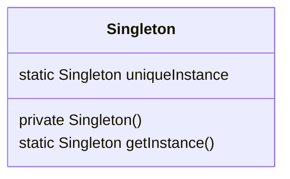
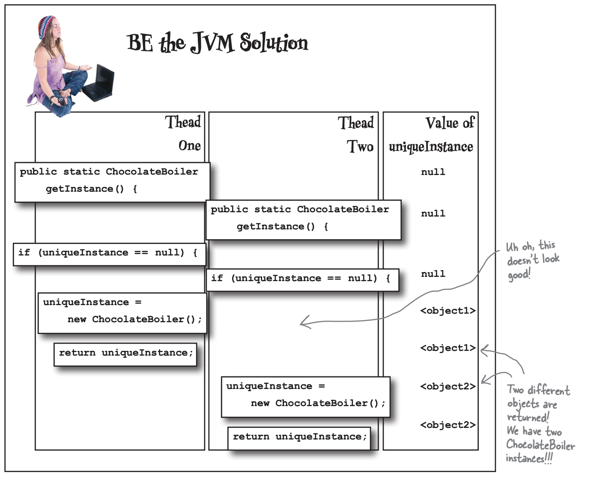

# 싱글턴 패턴

## 🧐 싱글턴 패턴이란?

싱글턴 패턴은 클래스 인스턴스를 정확하게 하나만 만들고, 그 인스턴스로의 전역 접근을 제공합니다.

## 🏗️ 싱글턴 패턴의 구조

싱글턴 패턴의 구조는 그 어떤 패턴보다도 간단합니다. 하나의 클래스만을 사용하기에 하나의 다이어그램으로 정의가 됩니다.

- **Singleton**: 클래스에서 하나뿐인 인스턴스를 관리하도록 만듭니다.



## 📝 싱글턴 사용 예시

### 문제 상황

브라우저의 테마 설정을 관리하는 `Theme` 클래스가 있다고 가정해 봅니다. 만약 이 클래스의 인스턴스가 여러 개 생성이 된다면 일관적인 테마가 아닌 요소마다 각기의 테마 색상으로 보여 UX를 해치게 될 겁니다.

```java
public class Theme {
    private COLOR themeColor;

    public Theme(COLOR themeColor) {
        this.themeColor = themeColor;
    }

    public COLOR getThemeColor() {
        return themeColor;
    }

    public void setThemeColor(COLOR themeColor) {
        this.themeColor = themeColor;
    }
}

public class Button {
    private String text;

    public Button(String text) {
        this.text = text;
    }

    public void display(Theme theme) {
        String themeColor = theme.getThemeColor();
        System.out.println(
            "Button [" + text + "] displayed in " + themeColor + " theme."
        );
    }
}

public class Label {
    private String text;

    public Label(String text) {
        this.text = text;
    }

    public void display(Theme theme) {
        String themeColor = theme.getThemeColor();
        System.out.println(
            "Label [" + text + "] displayed in " + themeColor + " theme."
        );
    }
}
```

이 코드에서는 각각의 요소별로 테마를 다르게 설정할 수 있어 일관성 있는 UI를 제공하기 어렵습니다. 이와 같이 서비스 혹은 시스템 내부적으로 하나만 관리되어야 하는 인스턴스는 싱글턴 패턴을 사용하면 도움을 받을 수 있습니다.

### 싱글턴 패턴을 사용한 해결책

싱글턴 패턴은 생성자를 private 접근자로 만들어 인스턴스 생성을 제한합니다. 이를 통해 클래스 내부적으로 인스턴스가 하나만 생성될 수 있도록 제어하여 여러 인스턴스가 생성되어 관리되는 문제를 해결할 수 있습니다.

```java
public class Theme {
    private static Theme instance;
    private Color themeColor;

    private Theme() {
        this.themeColor = Color.LIGHT;
    }

    public static Theme getInstance() {
        if (instance == null) {
            instance = new Theme();
        }
        return instance;
    }

    public Color getThemeColor() {
        return themeColor;
    }

    public void setThemeColor(Color themeColor) {
        this.themeColor = themeColor;
    }
}
```

`Theme` 클래스를 싱글턴 패턴으로 구현한 예시입니다. 생성자 함수를 private로 만들고 이를 getInstance() 에서만 호출이 가능하게 하여 인스턴스 생성을 제한합니다. 또한 이미 인스턴스가 생성되었다면 이를 반환하고, 없는 경우에만 새로운 인스턴스를 생성하여 하나의 인스턴스만 생성될 수 있도록 제한합니다.

```java
public class ThemeMain {
    public static void main(String[] args) {
        Button button = new Button("버튼");
        Label label = new Label("라벨");

        button.display();
        label.display();

        Theme.getInstance().setThemeColor(COLOR.DARK);

        button.display();
        label.display();
    }
}

--- 출력 ---
> Task :ThemeMain.main()
Button [버튼] displayed in LIGHT theme.
Label [라벨] displayed in LIGHT theme.

Button [버튼] displayed in DARK theme.
Label [라벨] displayed in DARK theme.
```

## 💥 멀티스레딩 싱글턴 문제

싱글스레드 환경에서는 위에 제공된 코드에서도 문제가 발생하지 않습니다. 다만 멀티스레드 환경에서 싱글턴을 이와 같이 구현하게 된다면 동시성 문제가 발생할 수 있습니다.



이 문제를 해결하기 위해서는 여러 가지 방법이 있습니다.

첫 번째 방법으로는 getInstance()에 synchronized 키워드를 추가하여 하나의 스레드만 메소드를 실행시킬 수 있게 하는 방법입니다. 다만, 이 방법을 사용하게 되면 동기화가 꼭 필요한 인스턴스 초기화 시점만이 아닌 메소드 호출 시마다 진행이 돼 불필요한 오버헤드가 증가합니다.

```java
public class Singleton {
  private static Singleton uniqueInstance;

  private Singleton() {}

  public static synchronized Singleton getInstance() {
    if (uniqueInstance == null) {
      uniqueInstance = new Singleton();
    }

    return uniqueInstance;
  }
}
```

두 번째 방법으로는 정적 초기화 부분에서 싱글턴의 인스턴스를 생성하는 방법입니다. 이렇게 하면 JVM에서 하나뿐인 인스턴스를 생성하고 이를 생성하기 전까지 그 어떤 스레드도 정적 변수에 접근할 수 없습니다. 다만 이 방법은 싱글턴의 장점인 게으른 인스턴스 생성을 불가능하게 합니다.

```java
public class Singleton {
  private static Singleton uniqueInstance = new Singleton();

  private Singleton() {}

  public static Singleton getInstance() {
    return uniqueInstance;
  }
}
```

세 번째 방법으로는 DCL(Double-Checked Locking)을 사용하여 getInstance()에서 동기화되는 부분을 줄이는 방법입니다. 이 방법을 사용하면 인스턴스가 생성되어 있는지 확인 후, 생성되어 있지 않았을 때만 동기화를 할 수 있습니다.

```java
public class Singleton {
  private volatile static Singleton uniqueInstance;

  private Singleton() {}

  public static Singleton getInstance() {
    if (uniqueInstance == null) {
      synchronized (Singleton.class) {
        if (uniqueInstance == null) {
          uniqueInstance = new Singleton();
        }
      }
    }

    return uniqueInstance;
  }
}
```

## 👍 싱글턴 패턴의 장단점 👎

### 장점

- 전역 접근점: 싱글턴 인스턴스에 대한 전역 접근점을 제공하여 어디서든 쉽게 접근할 수 있습니다.
- 인스턴스 생성 제어: 하나의 인스턴스만 생성되므로 메모리 사용을 줄일 수 있습니다.
- 상태 공유: 애플리케이션 전체에서 상태를 쉽게 공유할 수 있습니다.
- 초기화 지연: 필요한 시점에 인스턴스를 생성할 수 있어 리소스를 절약할 수 있습니다.

### 단점

- 단일 책임 원칙 위반: 싱글턴 클래스는 자신의 생성과 생명주기를 관리하는 동시에 본래의 기능도 담당하게 되어 단일 책임 원칙을 위반할 수 있습니다.
- 멀티스레드 환경에서의 주의: 멀티스레드 환경에서 동시에 접근할 경우 문제가 발생할 수 있어 동기화 처리가 필요합니다.
- 높은 의존성: 싱글턴 클래스가 변경되면 연결된 모든 객체도 바꿔야 할 가능성이 높아 느슨한 결합을 추구하기 어렵습니다.

## 🌍 실제 사용 사례

1. **스레드 풀**: 애플리케이션에서 스레드를 효율적으로 관리하기 위해 하나의 스레드 풀을 사용합니다. 이 스레드 풀은 싱글턴으로 구현되어 전체 애플리케이션에서 동일한 스레드 풀을 사용할 수 있습니다.
2. **캐시**: 데이터베이스 조회 결과나 계산 결과를 저장하는 캐시 시스템은 보통 싱글턴으로 구현됩니다. 이를 통해 모든 컴포넌트가 동일한 캐시 인스턴스를 사용하여 일관된 데이터를 유지할 수 있습니다.
3. **디바이스 드라이버**: 운영 체제에서 특정 하드웨어 장치를 제어하는 디바이스 드라이버는 싱글턴으로 구현됩니다. 이는 하나의 물리적 장치에 대해 여러 개의 드라이버 인스턴스가 생성되는 것을 방지하기 위함입니다.

## 🎯 결론

싱글턴 패턴은 다른 디자인 패턴에 비해 구조가 굉장히 단순하지만 다양한 곳에서 사용이 됩니다. 전역 상태 관리와 리소스 공유에 있어 매우 유용하지만, 과도한 사용은 코드의 결합도를 높이고 유지보수를 어렵게 만들 수 있습니다. 따라서 싱글턴 패턴을 사용할 때는 그 필요성을 신중히 고려하고, 적절한 상황에서만 사용해야 합니다. 또한 멀티스레드 환경에서의 안전성과 테스트 용이성을 고려하여 구현해야 합니다.
