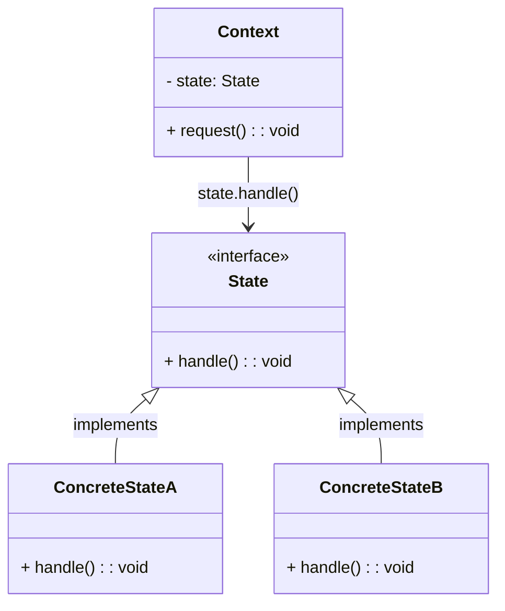
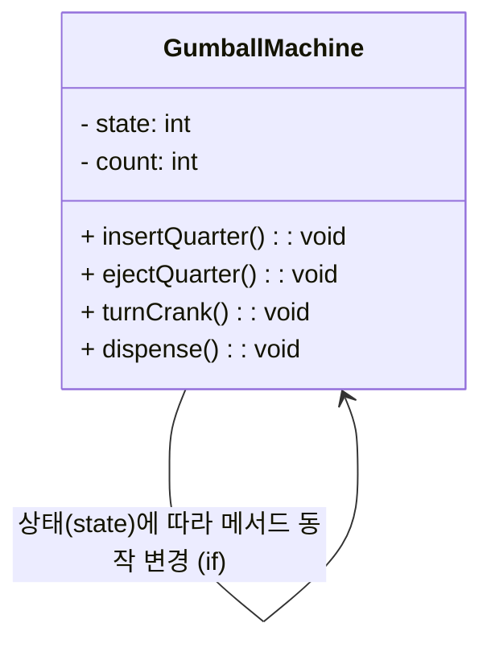
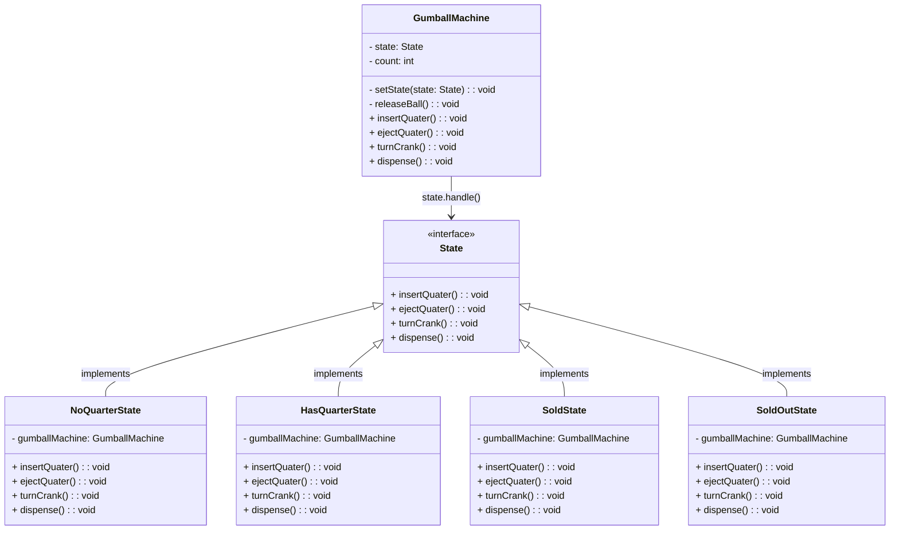

# 상태 패턴 (State Pattern)

> 💡 상태 패턴을 사용하면 객체의 내부 상태가 바뀜에 따라서 객체의 행동을 바꿀 수 있습니다.

## 패턴 분석

### 1. 컨텍스트 (Context)

컨텍스트는 객체의 상태에 따라 행동이 변해야 할 때입니다. 여기서 `GumballMachine`은 상태를 가지고 있으며, 그 상태에 따라 메서드의 동작이 달라집니다. 초기 구현에서는 상태가 정수값으로 지정되어
있으며, 상태에 따라 조건문을 사용해 메서드의 행동을 결정합니다. 상태 패턴을 적용한 `TO-BE`에서는 `GumballMachine`이 `State` 객체에 의존하며, 각 상태에 맞는 행동을 `State` 하위
클래스들이 담당합니다.

### 2. 문제 (Problem)

조건문으로 상태별 행동을 구현하면 코드가 복잡해지고 유지보수가 어렵습니다. 새로운 상태가 추가되면 `if-else`문이나 `switch`문에서 모든 관련 메서드를 수정해야 합니다. 이러한 방식은 코드의 가독성을
떨어뜨리고 확장성도 제한됩니다. 또한, 상태 변경이 빈번하게 발생하는 경우 코드가 비대해질 수 있습니다.

### 3. 해결책 (Solution)

상태 패턴을 도입하여 각 상태를 클래스로 분리하고, `GumballMachine`의 상태 변경 시 `State` 인터페이스를 통해 특정 상태 클래스의 행동을 호출하게 합니다. 각 상태가 고유의 클래스로 존재하므로,
상태별 행동을 독립적으로 정의할 수 있어 변경이 용이합니다. 예를 들어, `NoQuarterState`, `HasQuarterState` 등으로 분리함으로써 상태별 로직이 독립적으로 유지되고, 코드 중복이나 조건문의
복잡성을 줄일 수 있습니다.

## 도입의 장점

1. **유지보수 용이성**: 상태별로 독립된 클래스를 생성함으로써 코드를 모듈화하고, 특정 상태의 행동을 수정할 때 다른 상태에 영향을 미치지 않습니다.
2. **확장성**: 새로운 상태 추가 시 별도의 클래스로 쉽게 구현할 수 있어, 조건문을 수정하는 것보다 훨씬 수월합니다.
3. **가독성**: 조건문을 제거하고 상태에 따른 객체의 행동이 명확히 드러나, 코드 가독성이 높아집니다.

## 도입의 단점

1. **복잡성 증가**: 상태마다 클래스를 생성해야 하므로 클래스를 추가하는 작업이 다소 복잡해질 수 있습니다. 특히 상태가 많을 경우 전체 구조가 복잡해질 가능성이 있습니다.
2. **객체 수 증가**: 상태별로 객체를 생성해야 하므로 객체 수가 늘어납니다. 이는 메모리 사용에 영향을 줄 수 있습니다.
3. **의존성 관리**: `Context`와 여러 `State` 객체 간의 의존성이 증가할 수 있으며, 각 상태 간 전환 로직을 고려해야 합니다.

상태 패턴은 조건문으로 복잡하게 얽혀있는 상태 관리를 모듈화하고, 변경과 확장이 쉬운 코드 구조를 구현하는 데 효과적입니다. 다만 클래스 수 증가와 상태 간의 전환 관리 문제는 주의해야 할 필요가 있습니다.

## 상태 패턴 클래스 다이어그램

## 검볼 머신 구현하기

### 검볼 머신 클래스 다이어그램 (AS-IS)

### 검볼 머신 클래스 다이어그램 (TO-BE)

