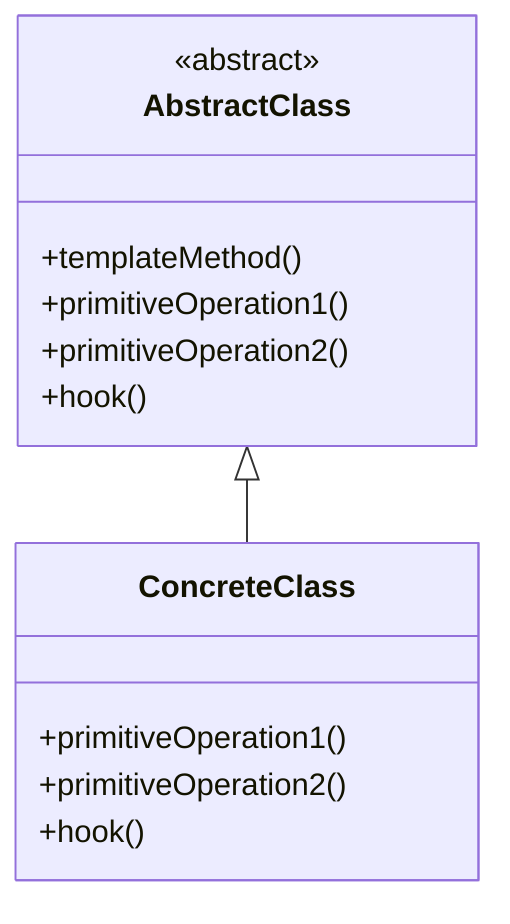

# 템플릿 메소드 패턴

## 🧐 템플릿 메소드 패턴이란?

템플릿 메소드 패턴은 **알고리즘의 구조를 정의**하고, 그 중 일부 단계를 하위 클래스에서 구현할 수 있도록 하는 행동 디자인 패턴입니다. 이 패턴은 알고리즘의 골격을 유지하면서도 구체적인 세부 사항을 변경할 수 있게 하여 **코드 재사용성**과 **유연성**을 높여줍니다. 또한, **중복 코드를 줄이고**, 변하지 않는 부분과 변하는 부분을 명확하게 분리할 수 있어 유지보수에도 용이합니다.

## 🏗️ 템플릿 메소드 패턴의 구조

템플릿 메소드 패턴은 주로 다음과 같은 구조를 가집니다.

1. **추상 클래스 (Abstract Class)**: 알고리즘의 골격을 정의하는 템플릿 메소드를 포함하는 추상 클래스입니다.
2. **구상 클래스 (Concrete Class)**: AbstractClass를 상속받아 구체적인 알고리즘 단계를 구현하는 클래스입니다.



**템플릿 메소드**는 알고리즘의 큰 틀을 정의하는 메소드로, 전체 실행 순서를 제어하며, 하위 클래스에서 변형할 수 없습니다. 이 메소드는 변하지 않는 **고정된 부분**을 보호하며, 유연성이 필요한 세부 사항은 하위 클래스에 위임합니다.

## 📝 템플릿 메소드 사용 예시

### 문제 상황

커피와 차를 만드는 과정을 생각해봅시다. 두 음료의 제조 과정은 비슷하지만, 세부적인 단계에서 차이가 있습니다. 이를 각각 별도의 클래스로 구현하면 중복 코드가 발생하고 유지보수가 어려워질 수 있습니다.

### 템플릿 메소드 패턴을 사용한 해결책

템플릿 메소드 패턴을 사용하여 음료 제조 과정의 공통 부분을 추상 클래스에 정의하고, 각 음료의 특정 단계를 서브클래스에서 구현할 수 있습니다.

```java
public abstract class CaffeineBeverage {

    // 템플릿 메소드
    final void prepareRecipe() {
        boilWater();
        brew();
        pourInCup();
        addCondiments();
    }

    abstract void brew();

    abstract void addCondiments();

    void boilWater() {
        System.out.println("물 끓이는 중");
    }

    void pourInCup() {
        System.out.println("컵에 따르는 중");
    }
}

public class Coffee extends CaffeineBeverage {
    public void brew() {
        System.out.println("필터로 커피를 우려내는 중");
    }

    public void addCondiments() {
        System.out.println("설탕과 우유를 추가하는 중");
    }
}

public class Tea extends CaffeineBeverage {
    public void brew() {
        System.out.println("차를 우려내는 중");
    }

    public void addCondiments() {
        System.out.println("레몬을 추가하는 중");
    }
}
```

이 예제에서 `CaffeineBeverage` 클래스는 음료 제조의 전체적인 알고리즘을 정의하는 템플릿 메소드 `prepareRecipe()`를 제공합니다. `Coffee`와 `Tea` 클래스는 이를 상속받아 `brew()`와 `addCondiments()` 메소드를 각자의 방식으로 구현합니다.

```java
public class BeverageTest {
    public static void main(String[] args) {
        Tea tea = new Tea();
        Coffee coffee = new Coffee();

        tea.prepareRecipe();
        coffee.prepareRecipe();
    }
}

--- 출력 ---
물을 끓이는 중
차를 우려내는 중
컵에 따르는 중
레몬을 추가하는 중

물을 끓이는 중
커피를 내리는 중
컵에 따르는 중
설탕과 우유를 추가하는 중
```

## 🪝 후크(Hook) 메소드

템플릿 메소드 패턴에서 후크는 추상 클래스에 선언되어 있지만 기본적인 내용만 구현되어 있거나 아무 내용도 들어있지 않은 메소드입니다. 이를 통해 서브클래스는 알고리즘의 특정 지점에 끼어들거나 선택적인 부분을 구현할 수 있습니다.

### 후크의 주요 특징

- 선택적 오버라이드: 서브클래스는 필요에 따라 후크 메소드를 오버라이드할 수 있습니다.
- 기본 동작 제공: 후크는 기본 구현을 제공할 수 있으며, 서브클래스는 이를 필요에 따라 변경할 수 있습니다.
- 알고리즘 확장점: 후크는 알고리즘의 특정 지점에서 추가적인 동작을 수행할 수 있는 기회를 제공합니다.

### 후크 사용 예시

위의 CaffeineBeverage 예제에서 customerWantsCondiments() 메소드가 후크의 역할을 합니다. 이 메소드를 확장하여 더 구체적인 예시를 들어보겠습니다.

```java
public abstract class CaffeineBeverage {

    // 템플릿 메소드
    final void prepareRecipe() {
        boilWater();
        brew();
        pourInCup();
        if (customerWantsCondiments()) {
            addCondiments();
        }
    }

    abstract void brew();

    abstract void addCondiments();

    void boilWater() {
        System.out.println("물 끓이는 중");
    }

    void pourInCup() {
        System.out.println("컵에 따르는 중");
    }

    // 후크(hook) 메소드
    boolean customerWantsCondiments() {
        return true;
    }
}

public class Coffee extends CaffeineBeverage {
    public void brew() {
        System.out.println("필터로 커피를 우려내는 중");
    }

    public void addCondiments() {
        System.out.println("설탕과 우유를 추가하는 중");
    }

    // 후크 메소드 오버라이드
    @Override
    boolean customerWantsCondiments() {
        String answer = getUserInput();

        if (answer.toLowerCase().startsWith("y")) {
            return true;
        } else {
            return false;
        }
    }

    private String getUserInput() {
        System.out.print("커피에 우유와 설탕을 추가하시겠습니까? (y/n)?");
        // 사용자 입력을 받는 로직
    }
}

public class Tea extends CaffeineBeverage {
    public void brew() {
        System.out.println("차를 우려내는 중");
    }

    public void addCondiments() {
        System.out.println("레몬을 추가하는 중");
    }
}
```

이 예시에서 customerWantsCondiments() 후크 메소드는 CaffeineBeverage 클래스에서 기본적으로 true를 반환합니다. Coffee 클래스에서는 이를 오버라이드하여 사용자의 입력에 따라 우유와 설탕의 추가 여부를 결정합니다. 반면 Tea 클래스는 후크 메소드를 오버라이드하지 않아 기본 구현을 사용합니다.

후크를 사용함으로써 알고리즘의 선택적인 부분을 유연하게 제어할 수 있으며, 서브클래스에 더 많은 권한을 부여할 수 있습니다. 이는 템플릿 메소드 패턴의 유연성을 크게 향상시키는 중요한 기능입니다.

## 🦆 Java의 Arrays.sort()와 템플릿 메소드 패턴

Java의 `Arrays.sort()` 메소드는 템플릿 메소드 패턴의 대표적인 사용 사례입니다. 이 메소드는 배열을 정렬하는 알고리즘의 골격을 제공하며, 각 배열 요소의 비교 방법을 커스터마이징할 수 있도록 합니다. 즉, **템플릿 메소드**는 정렬 알고리즘의 흐름을 정의하고, **Comparable** 인터페이스를 통해 비교 기준을 사용자에게 맡깁니다.

### 오리 비교 예시

예를 들어, `Duck` 객체의 배열을 크기 순으로 정렬한다고 가정해보겠습니다. 이때 `Arrays.sort()`는 정렬 알고리즘을 제공하며, `compareTo()` 메소드를 구현한 `Duck` 클래스는 비교 방법을 제공합니다.다음은 오리 객체를 비교하는 예시입니다.

```java
public class Duck implements Comparable<Duck> {
    String name;
    int weight;

    public Duck(String name, int weight) {
        this.name = name;
        this.weight = weight;
    }

    public String toString() {
        return name + " weighs " + weight;
    }

    @Override
    public int compareTo(Duck otherDuck) {
        if (this.weight < otherDuck.weight) {
            return -1;
        } else if (this.weight == otherDuck.weight) {
            return 0;
        } else {
            return 1;
        }
    }
}

public class DuckSortTestDrive {
    public static void main(String[] args) {
        Duck[] ducks = {
            new Duck("Daffy", 8),
            new Duck("Dewey", 2),
            new Duck("Howard", 7),
            new Duck("Louie", 2),
            new Duck("Donald", 10),
            new Duck("Huey", 2)
        };

        System.out.println("정렬 전:");
        display(ducks);

        Arrays.sort(ducks);

        System.out.println("\n정렬 후:");
        display(ducks);
    }

    public static void display(Duck[] ducks) {
        for (Duck d : ducks) {
            System.out.println(d);
        }
    }
}

--- 출력 ---
정렬 전:
Daffy weighs 8
Dewey weighs 2
Howard weighs 7
Louie weighs 2
Donald weighs 10
Huey weighs 2

정렬 후:
Dewey weighs 2
Louie weighs 2
Huey weighs 2
Howard weighs 7
Daffy weighs 8
Donald weighs 10
```

이 예제에서 `Arrays.sort()` 메소드는 정렬 알고리즘의 템플릿을 제공하고, `Duck` 클래스의 `compareTo()` 메소드가 실제 비교 로직을 구현합니다.

## 🎬 할리우드 원칙 (Hollywood Principle)

템플릿 메소드 패턴은 **할리우드 원칙**을 따릅니다. 할리우드 원칙이란, **상위 수준의 구성 요소가 하위 수준 구성 요소를 제어**하며, 하위 수준에서 상위 수준에 지나치게 의존하지 않도록 설계하는 원칙입니다.

### 할리우드 원칙의 핵심 아이디어

- 고수준 컴포넌트가 저수준 컴포넌트의 동작을 제어합니다.
- 저수준 컴포넌트는 고수준 컴포넌트에 의해 사용되지만, 언제 어떻게 사용될지 결정하지 않습니다.
- 이는 의존성 부패(dependency rot)를 방지하는 데 도움을 줍니다.

이 원칙을 따르면 시스템의 의존성을 줄이고 결합도를 낮출 수 있습니다.

## 👍 템플릿 메소드 패턴의 장단점 👎

### 장점

- 코드 중복을 줄이고 재사용성을 높입니다.
- 알고리즘의 특정 부분만 변경하고 싶을 때 유용합니다.
- 여러 클래스에 걸쳐 동일한 행동을 집중화할 수 있습니다.
- 할리우드 원칙을 통해 의존성 문제를 완화합니다.

### 단점

- 템플릿 구조가 복잡해질수록 유지보수가 어려워질 수 있습니다.
- 상속을 사용하기 때문에 상속의 단점(예: 긴밀한 결합)을 그대로 가집니다.

## 🌍 실제 사용 사례

1. **프레임워크의 기본 클래스**: 많은 프레임워크에서 기본 동작을 정의하고 사용자가 필요한 부분만 오버라이드할 수 있게 합니다.
2. **GUI 라이브러리**: 버튼이나 윈도우 같은 컴포넌트의 기본 동작을 정의하고, 개발자가 필요한 부분만 커스터마이즈할 수 있게 합니다.
3. **데이터 처리 파이프라인**: 데이터 처리의 전체적인 흐름은 동일하지만 특정 단계에서 다른 처리가 필요한 경우에 사용됩니다.
4. **Java의 Collections Framework**: `AbstractList`, `AbstractSet` 등의 클래스들이 템플릿 메소드 패턴을 사용합니다.

## 🆚 템플릿 메소드 패턴 vs 전략 패턴

### 주요 차이점

1. **구현 방식**:
   템플릿 메소드 패턴: 상속을 사용
   전략 패턴: 구성(composition)을 사용

2. **알고리즘 변경 시기**:

   템플릿 메소드 패턴: 컴파일 시간에 결정
   전략 패턴: 런타임에 동적으로 변경 가능

3. **코드 재사용**:

   템플릿 메소드 패턴: 상위 클래스의 코드를 재사용
   전략 패턴: 각 전략이 독립적으로 구현되어 재사용

4. **변화의 성격**:

   템플릿 메소드 패턴: 알고리즘의 뼈대는 고정, 세부 단계만 변경
   전략 패턴: 전체 알고리즘을 교체 가능

### 상세 비교

**템플릿 메소드 패턴**

- 알고리즘의 골격을 정의하고, 일부 단계를 서브클래스에서 구현하도록 함
- 전체적인 알고리즘의 구조는 변경되지 않음
- 서브클래스는 특정 단계만을 재정의할 수 있음
- 훅(hook)을 통해 선택적인 단계를 구현할 수 있음

**전략 패턴**

- 알고리즘 전체를 캡슐화하고, 런타임에 교체 가능
- 클라이언트가 사용할 구체적인 전략을 선택할 수 있음
- 새로운 전략을 추가하기 쉬움
- 객체의 행동을 동적으로 변경할 수 있음

### 사용 시나리오

**템플릿 메소드 패턴**
알고리즘의 기본 뼈대는 같지만, 세부 구현이 다른 여러 클래스가 필요할 때 사용

- 문서 생성 프로세스
- 데이터 마이닝 알고리즘

**전략 패턴**
런타임에 알고리즘을 선택하거나 교체해야 할 때 사용

- 다양한 할인 정책
- 다양한 정렬 알고리즘

## 🎯 결론

템플릿 메소드 패턴은 알고리즘의 구조를 명확히 하고 코드 재사용성을 높여주는 패턴입니다. 할리우드 원칙을 통해 의존성 문제를 해결하면서도 유연성을 제공합니다. 그러나 복잡한 상속 구조를 만들 수 있으므로 신중하게 사용해야 합니다. 알고리즘의 뼈대는 같지만 세부 구현이 다른 여러 클래스가 필요할 때 이 패턴을 유용하게 사용할 수 있습니다.
